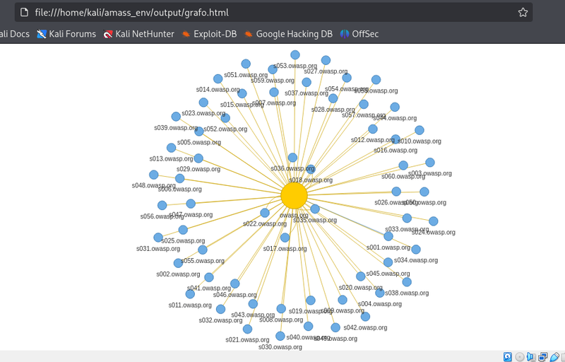

# De la enumeración a la visualización — Amass + Python (demo reproducible)



**Resumen**

Este repositorio es un mini-pipeline para convertir listas de subdominios en un grafo interactivo HTML usando **NetworkX + PyVis**. Está pensado para demostraciones, formación y documentación de pipelines de enumeración de forma **ética** y reproducible.

El objetivo: mostrar visualmente la relación **subdominio → dominio padre** (nodo central grande = dominio padre; nodos alrededor = subdominios) y ofrecer una demo que puedas ejecutar **localmente** sin exponer a terceros.

---

## Contenido

- `build_graph_from_combined.py` — script principal. Lee un archivo de hosts (uno por línea, o `host,source`) y genera `output/grafo.html` con PyVis.
- `data/combined_limited.txt` — ejemplo pequeño con hosts sintéticos (opcional).
- `output/grafo.html` — ejemplo de salida (opcional, se puede generar con el script).
- `scripts/gen_fake_hosts.sh` — (opcional) genera hosts sintéticos para pruebas.
- `scripts/gen_fake_relations.py` — (opcional) añade metadatos sintéticos.
- `README.md` — este documento.
- `LICENSE` — plantilla MIT (recomendado).

---

## Por qué usar esto

- Visualizar relaciones entre subdominios y su dominio padre facilita explicar arquitectura y resultados de recon a equipos técnicos y no técnicos.
- PyVis ofrece interactividad (zoom, arrastrar nodos, tooltips) y NetworkX facilita el cálculo de métricas simples (grado, componentes, etc.).
- El flujo está diseñado para ser reproducible y ejecutable **localmente** con datos sintéticos o dominios propios.

---

## Requisitos mínimos

- Linux (Kali / Ubuntu recomendado)
- Python 3.8+
- pip
- (Opcional) `amass` para enumeración pasiva
- (Opcional) `jq` para procesar JSON de `crt.sh`

Instalación rápida (recomendado en venv):

```
python3 -m venv venv
source venv/bin/activate
pip install --upgrade pip
pip install networkx pyvis pandas

```
1. Crear datos sintéticos y directorios:

 ```
mkdir -p data output
for i in $(seq 1 60); do printf "s%02d.tulab.local\n" "$i"; done > data/combined_limited.txt
wc -l data/combined_limited.txt && head -n 10 data/combined_limited.txt

```

3. Generar el grafo:
   
```
python build_graph_from_combined.py data/combined_limited.txt --out output/grafo.html
xdg-open output/grafo.html || echo "Abre output/grafo.html en tu navegador"

```

Verás un HTML interactivo con nodos que representan subdominios y sus dominios padres. El tamaño del nodo se corresponde con el grado (número de conexiones).

Integración responsable con fuentes públicas

Si quieres enriquecer la demo con datos reales, combina Amass (modo pasivo) con consultas a crt.sh y procesa todo localmente antes de visualizar. Ejemplos y datos reales solo deben usarse si trabajas sobre dominios propios o cuentas con permiso explícito.

Nota sobre prácticas inseguras: durante el desarrollo encontré scripts/automatizaciones que extraían grandes volúmenes de datos desde UIs públicas (por ejemplo Tampermonkey sobre paneles web). Considero esas prácticas de alto riesgo (legales/éticas) y las he eliminado del laboratorio. En su lugar recomiendo siempre usar fuentes pasivas públicas y APIs autorizadas cuando existan.

### Buenas prácticas

No publiques listas de subdominios de terceros en repositorios públicos. Usa datos sintéticos o dominios de prueba.

Respeta las ToS de los proveedores; evita scraping de UIs y técnicas que puedan considerarse abuso.

Limita la cantidad de nodos al generar la visualización (usar head o truncado) para evitar que el navegador se quede sin memoria.

Anonimiza o difumina dominios en capturas si usas datos reales.

Ejemplo: flujo mínimo (snippet)


# generar hosts sintéticos

```
mkdir -p data output
for i in $(seq 1 60); do printf "s%02d.tulab.local\n" "$i"; done > data/combined_limited.txt

```
# entorno python

```
python3 -m venv venv
source venv/bin/activate
pip install networkx pyvis

```
# generar grafo

```
python build_graph_from_combined.py data/combined_limited.txt --out output/grafo.html

```
Enriquecer con crt.sh + Amass (USAR SOLO EN DOMINIOS PROPIOS / CON PERMISO)

```
DOM=example.org
```
# crt.sh (salida JSON -> lista limpia)

```
curl -s -A "Mozilla/5.0" "https://crt.sh/?q=${DOM}&output=json" > /tmp/crtsh_raw.json
jq -r '.[].name_value' /tmp/crtsh_raw.json | sed 's/\*\.//g' | tr '[:upper:]' '[:lower:]' | sort -u > data/crtsh.txt

```
# Amass pasivo (limitar salida si hace falta)

```
amass enum -passive -d ${DOM} | head -n 200 > data/amass_sample.txt

```

# combinar

```
cat data/crtsh.txt data/amass_sample.txt 2>/dev/null | sort -u > data/combined_with_crtsh.txt
head -n 300 data/combined_with_crtsh.txt > data/combined_with_crtsh_limited.txt
python build_graph_from_combined.py data/combined_with_crtsh_limited.txt --out output/grafo_crtsh.html

```

